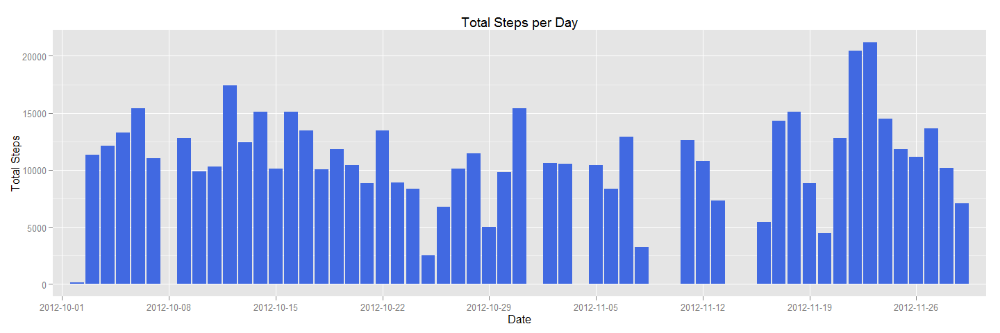
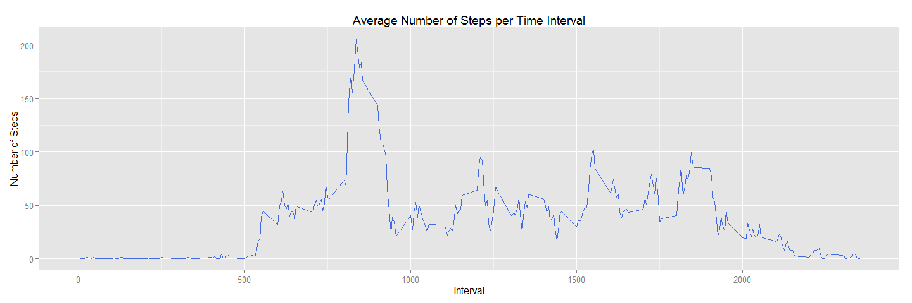
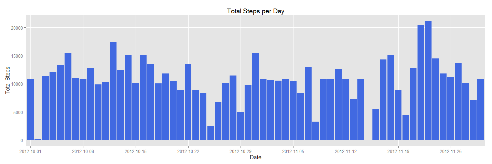
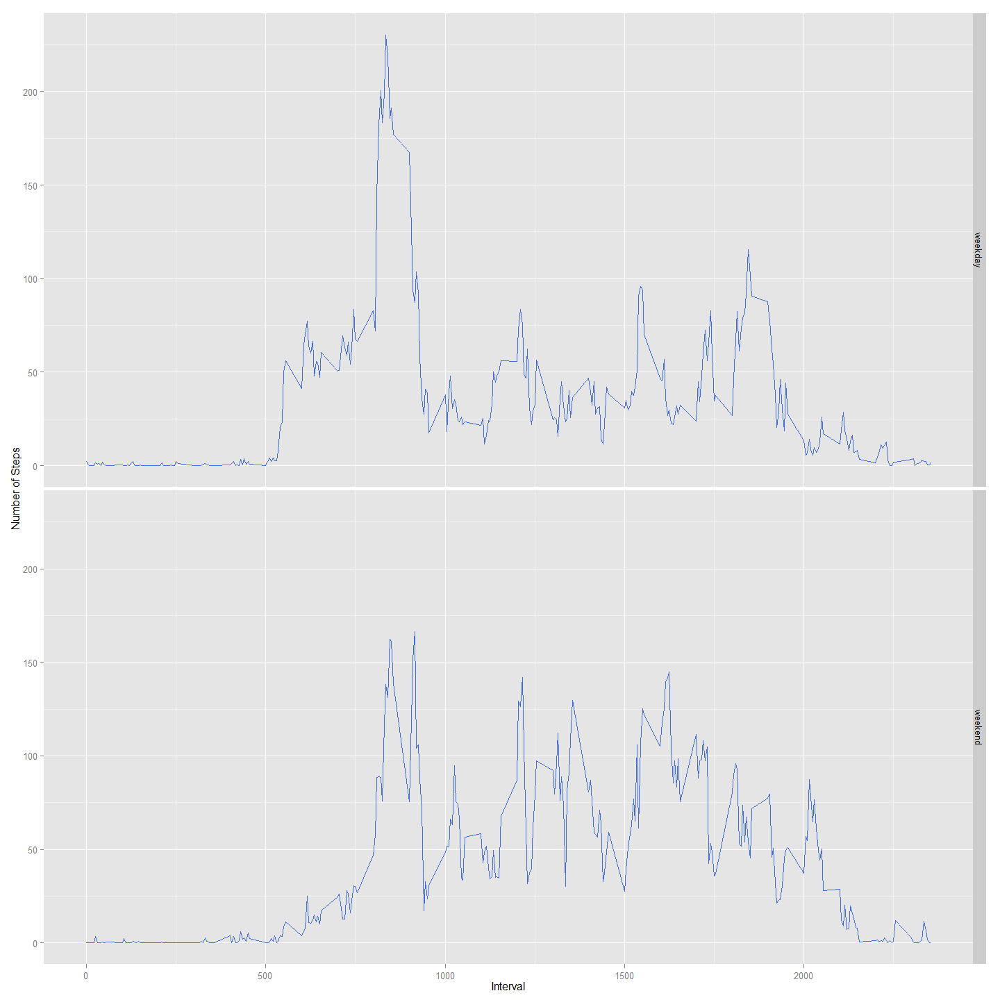

# Reproducible Research: Peer Assessment 1


## Loading and preprocessing the data

#### Data
- Data was downloaded from the following github repo  
[https://github.com/rdpeng/RepData_PeerAssessment1]
(https://github.com/rdpeng/RepData_PeerAssessment1)
 forked on 11/15/2014.  
 
- The data set is contained in a .csv file named activity.csv
 
#### Code Book  
 - **Raw Data**
    - **steps:**    The number of steps taken in a 5 minute interval.  
    - **date:**     The date the measurement was taken.  Format: YYYY-MM-DD.  
    - **interval:** 5 minute interval identifier.  This is an integer that 
    represents the time of the beginning of the 5 minute interval.  Format HHMM 
    where HH represents the hour of the day (0-24), MM represents the minutes 
    (0-55).  Leading zeros are dropped.

 - **Processed Data**  
 We will add a date/time column to the raw data.  The processed data
 will have the 3 variables listed above plus the following: 
    - **dateTime;**  A date/time value calculated from the date 
    and interval variables.  Format: POSIXct. 


```r
# Load raw data.
dataFile <- "./Data/activity.csv"
rawData <- read.csv(dataFile)

## Preprocess raw data into a data frame called procData by adding a POSIXct dateTime 
procData <- within (rawData, {
    dateTime <- as.POSIXct(sprintf("%s %0.4d", date, interval), format = "%Y-%m-%d %H%M")
})
```
  
  
***
  
  
## What is mean total number of steps taken per day?
#### Historgram of total steps taken per day  
In order to get a histogram of total steps take per day we need a weighted histogram.  
If we take a normal histogram of the date variable we would get count of the number 
of observations per day (i.e. 288).  However if we weight (multiply) each observation 
by the number of steps taken in that observation we will get a histogram of the 
total steps taken per day.  


```r
# Histogram of date weighted by steps.  This gives us a historam of total steps/day.
library(ggplot2)
qplot(date, data = procData, weight = steps) +
    labs(title = "Total Steps per Day", x = "Date", y = "Total Steps") +
    geom_bar(fill = "royalblue") +
    
    # De-clutter the x axis by only showing every 7th date   
    scale_x_discrete(breaks = c("2012-10-01","2012-10-08","2012-10-15","2012-10-22","2012-10-29",
                                "2012-11-05","2012-11-12","2012-11-19","2012-11-26"))
```

 
#### Mean and median of total steps take per day.  
First we will create a data frame of the daily statistics consisting of:
- **date:** Date of observations.
- **totalSteps**    Total number of steps taken on that date.  
- **meanSteps**    Mean value of steps per time period on that date.  
- **medianSteps**   Median value of steps taken per time period on that date.


```r
# Calculate total, mean and median number of steps per day.  We can drop NA values.
# Note: median = 0 for most days becasue steps = 0 for > 1/2 of intervals.

library(plyr)
dailyData <- ddply(procData, "date", summarise,
                totalSteps = sum(steps, na.rm = TRUE),
                meanSteps = mean(steps, na.rm = TRUE),
                medianSteps = median(steps, na.rm = TRUE))
```
For the mean value of total steps per day we will take the mean of the totalSteps 
column of the dailyData data frame.  

```r
# Mean of daily total steps
dailyMean <- mean(dailyData$totalSteps, na.rm = TRUE)
dailyMean
```

```
## [1] 9354.23
```
For the median value of total steps per day we will take the median of the 
totalSteps column of the dailyData data frame.  

```r
# Median of daily total steps
dailyMedian <- median(dailyData$totalSteps, na.rm = TRUE)
dailyMedian 
```

```
## [1] 10395
```

The mean of total steps per day is 9354.2295082.  
The median of total steps per day is 10395.
  
  
***
  
  
## What is the average daily activity pattern?

To look at the average daily activity pattern we are going to take the mean 
value of the steps per interval averaged over all days.  We will put this 
in a data frame called intervalMean.

```r
# calculate mean by time interval
require(plyr)
intervalMean <- ddply(procData, "interval", summarise, meanSteps = mean(steps, na.rm = TRUE)) 
```
   
Now we will plot intervalMean vs. interval:

```r
# Creat plot of meanSteps ~ interval
require(ggplot2)

ggplot(intervalMean, aes(x = interval, y = meanSteps)) +
    geom_line(color = "royalblue") +
    labs(title = "Average Number of Steps per Time Interval", x = "Interval", y = "Number of Steps")
```

 
  
Now to find the 5 minute interval which, when averaged across all days, contains 
the maximum number of steps.  We ill use the max function in R to do this.

```r
# Find interval with the maximum average number of steps
maxInterval <- intervalMean[intervalMean$meanSteps == max(intervalMean$meanSteps),]
maxInterval
```

```
##     interval meanSteps
## 104      835  206.1698
```
This means that, on average, this person takes the most steps during interval 
835 with an average of 206 steps.  

***  
  
  
## Imputing missing values  

#### Calculating the number of missing values  
The is.na function will return 1 (TRUE) if a value is NA and 0 (FALSE) if a value 
is not NA.  Consequently, we can sum up the values of the is.na function to get the 
total number of NA values.

```r
# Find the number of NA values for the steps variable
numNA <- sum(is.na(procData$steps))
numNA
```

```
## [1] 2304
```
The number of NA values in the steps column is 2304  
  
  
  
#### Strategy for imputing the missing values  
To impute the missing values we are going to use the average value taken over 
all days for the same interval.  These values were calculated above and are 
contained in the intervalMean data frame. 
  
#### Creating the new dataset
We are going to create the new data set by:  
- splitting the processed data (procData) into two data frames: one containing 
complete observation and on containing NA values in the steps column.  
- We will then merge the data set containing NA values with the data set of 
average steps per interval.
- Round the meanSteps value in the merged data frame and assign the results to 
the steps column, over writing the NA values.  
- Drop the mean steps column.
- Row bind the resulting data frame back onto the complete observations data frame.  
- Re-order the resulting data frame back into it's original order.

```r
# Impute missing values by breaking the date frame procData into 2 data frames,
# One containing complete observations (dataComp)and on containing NA
# values for steps (dataNA).  We will then merg the dataNA with intervalMean
# and then row bind the merged data frame to dataComp.
library(stats)

# Split data frame
dataComp <- procData[complete.cases(procData),]
dataNA <- procData[!complete.cases(procData),]

#  Megere data frames
dataImputed <- merge(dataNA, intervalMean)

# Round the the mean values so they are integers and assign the value to steps 
dataImputed$steps <- round(dataImputed$meanSteps)

# Drop the meanSteps column
dataImputed <- dataImputed[, -5]

# Put the data frames back together with rbind
dataImputed <- rbind(dataComp, dataImputed)

# Re-order the data frame so it's back in the original order using plyr arrange
dataImputed <- arrange(dataImputed, dateTime)
```
#### Historgram of total steps taken per day with imputed values  
We will plot the imputed data exaclty as we did with the processed data above, 
substituting the imputed data set.  


```r
# Histogram of date weighted by steps.  This gives us a historam of total steps/day.
require(ggplot2)
qplot(date, data = dataImputed, weight = steps) +
    labs(title = "Total Steps per Day", x = "Date", y = "Total Steps") +
    geom_bar(fill = "royalblue") +
    
    # De-clutter the x axis by only showing every 7th date   
    scale_x_discrete(breaks = c("2012-10-01","2012-10-08","2012-10-15","2012-10-22","2012-10-29",
                                "2012-11-05","2012-11-12","2012-11-19","2012-11-26"))
```

 
#### Mean and median of total steps take per day with imputed data.  
Again we will use  the same precess as we did with the processed data, substituting 
the imputed data set.  
  


```r
# Calculate total, mean and median number of steps per day.
# Note: median = 0 for most days becasue steps = 0 for > 1/2 of intervals.

library(plyr)
dailyDataImputed <- ddply(dataImputed, "date", summarise,
                    totalSteps = sum(steps, na.rm = TRUE),
                    meanSteps = mean(steps, na.rm = TRUE),
                    medianSteps = median(steps, na.rm = TRUE))
```
For the mean value of total steps per day we will take the mean of the totalSteps 
column of the dailyDataImputed data frame.  

```r
# Mean of daily total steps
impMean <- mean(dailyDataImputed$totalSteps)
impMean
```

```
## [1] 10765.64
```
For the median value of total steps per day we will take the median of the 
totalSteps column of the dailyDataImputed data frame.  

```r
# Median of daily total steps
impMedian <- median(dailyDataImputed$totalSteps)
impMedian 
```

```
## [1] 10762
```
#### Comparing values with and without imputed values.  
Mean total steps per day.  
- With NA values:       9354  
- With imputed values:  10765  
  
Median total steps per day.  
- With NA values:       10395  
- With imputed values:  10762 

***  

## Are there differences in activity patterns between weekdays and weekends?  
#### Adding a new column to the imputed data set.  
We will add a column, dayType designating whether the the day is a weekday or 
a weekend.  
First create a function that returns whether a date is a weekend or a weekday.  
The function will take a POSIXct vector, use the Weekdays function on each element 
of the vector.  If the resulting day starts with "S" assign it the valule "weekend" 
else assign it the value "weekday."


```r
# Function takes a POSIXct vector and retruns a charater vecttor of the same lenght 
# designating the date as a "weekend" or a "weekday"
getDayType <- function(x){
    xOut <- character(length(x))
    for (i in 1:length(x)) {
        if(grepl("^S", weekdays(x[i]))) xOut[i] <- "weekend" else xOut[i] <- "weekday"
    }
    xOut
}
```
Next, add the dayType column to the dataImputed data frame and make it a factor.  

```r
# Add dayType columne to the imputed data set.
# The cbind function conveniently converts dayType to a factor for us.
dayType <- getDayType(dataImputed$dateTime)
dataImputed <- cbind(dataImputed, dayType)
```
Now create a data frame that splits the dataImputed data frame on interval and 
dayType.  Then take the mean of each daypart and unsplit the the data.  we will 
use the plyr package to do this.  


```r
# Split data frame on interval and dayType, take the mean of the intervals
# and unsplit the data frame usning dplyr.library(plyr)
meansByDayType <- ddply(dataImputed, c("dayType", "interval"), summarise,
                   meanSteps = mean(steps))
```
Finally create a panel plot of average total steps per interval by day type.


```r
# Create panel plot of average total steps per time period by day type
library(ggplot2)
qplot(interval, meanSteps, data = meansByDayType, geom = "line", facets = dayType~. ) +
    geom_line(color = "royalblue")  + 
    labs(x = "Interval", y ="Number of Steps")
```

 


